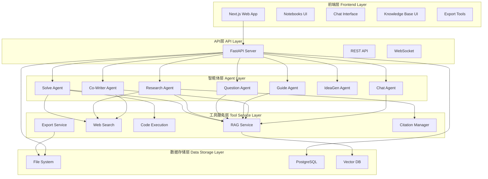
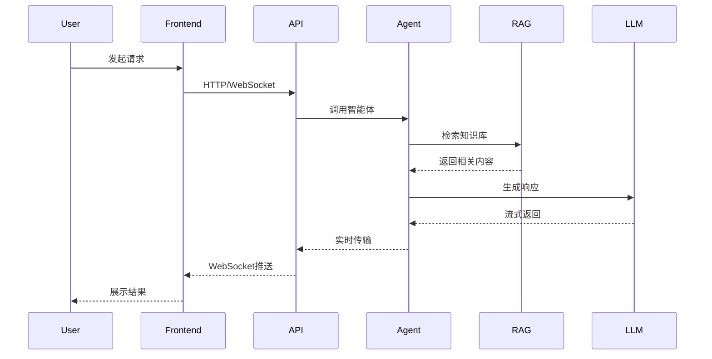
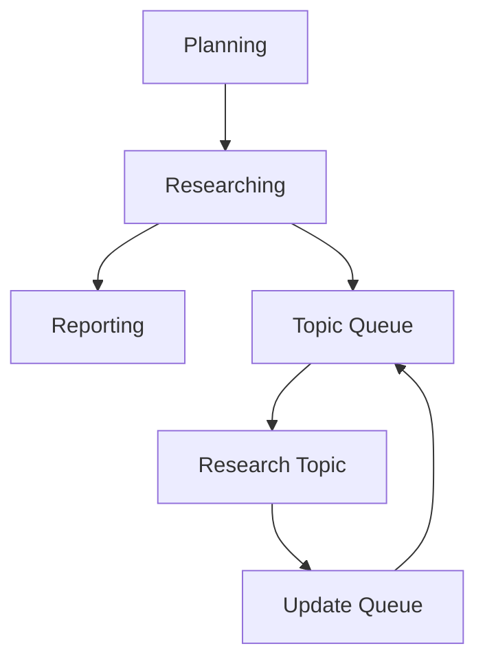
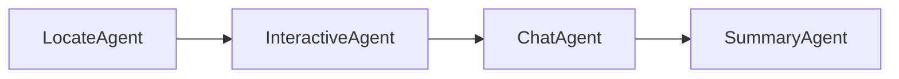
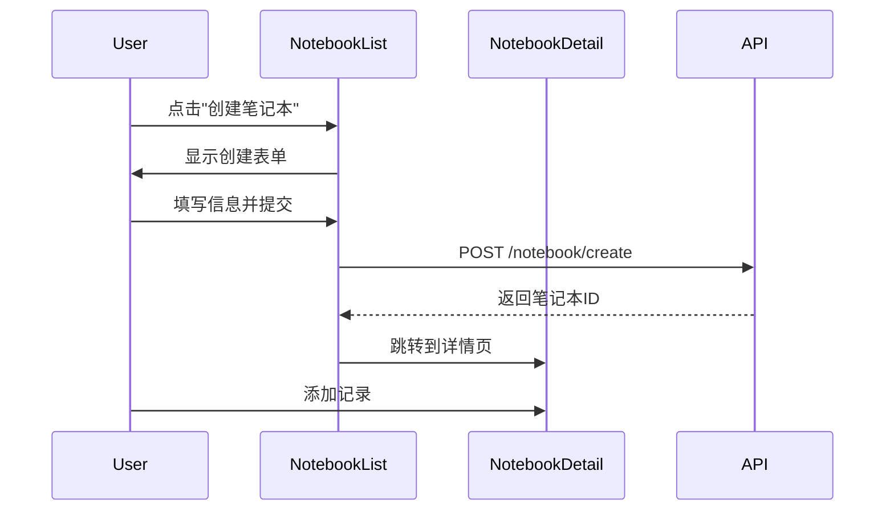
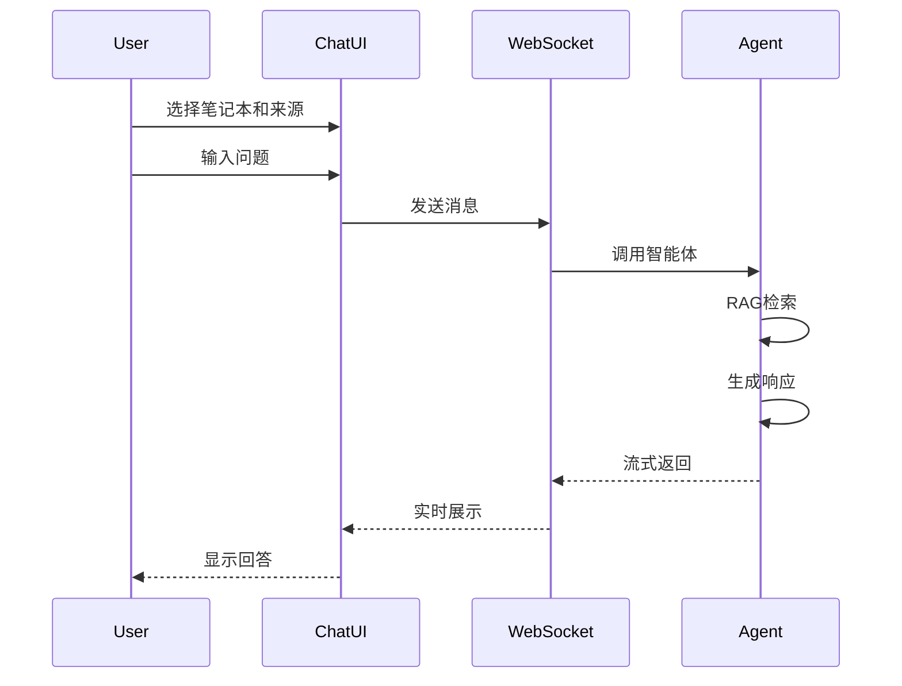
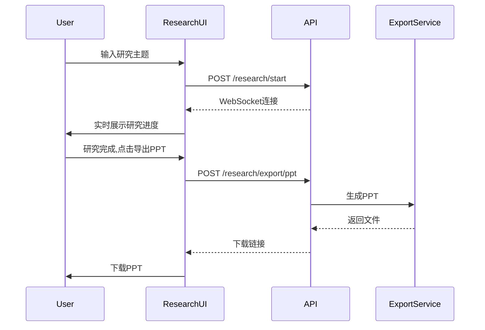
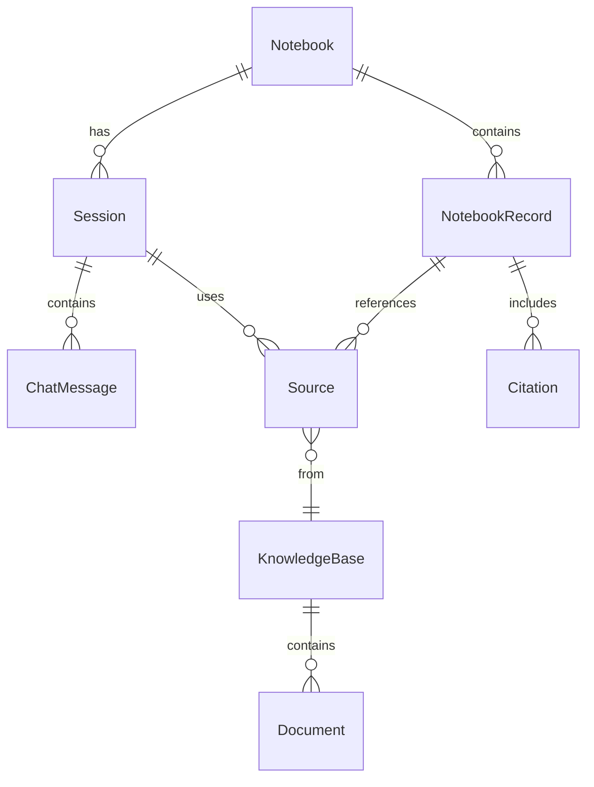

# Hinotebook 产品需求文档 (PRD)

**版本**: v1.0
**创建日期**: 2026-02-27
**产品名称**: Hinotebook
**所属项目**: DeepTutor

---

## 目录

1. [产品概述](#产品概述)
2. [用户画像](#用户画像)
3. [功能架构](#功能架构)
4. [核心功能详述](#核心功能详述)
5. [技术架构](#技术架构)
6. [交互设计](#交互设计)
7. [数据模型](#数据模型)
8. [非功能需求](#非功能需求)
9. [部署与配置](#部署与配置)
10. [未来规划](#未来规划)

---

## 一、产品概述

### 1.1 产品定位

**Hinotebook** 是一个AI驱动的个性化学习助手与知识管理系统,作为DeepTutor项目的核心模块,为用户提供全方位的学习支持和知识管理能力。

### 1.2 产品愿景

打造一个集知识管理、智能问答、深度研究、学习辅导于一体的综合性学习平台,通过多智能体协作和RAG(检索增强生成)技术,为用户提供个性化、高效的学习体验。

### 1.3 核心价值

- **多智能体协作**: 集成问题求解、深度研究、问题生成、协作写作等多个专业智能体
- **RAG检索增强**: 基于用户知识库的上下文感知对话和内容生成
- **实时交互**: WebSocket实时流式响应,提供流畅的用户体验
- **知识沉淀**: 完整的笔记本系统,记录学习过程和研究成果

### 1.4 目标场景

1. **学术研究**: 文献调研、研究创意生成、学术写作辅助
2. **自主学习**: 系统化学习、知识整理、进度追踪
3. **考试准备**: 问题生成、引导学习、知识点梳理
4. **内容创作**: 协作写作、PPT生成、播客制作

---

## 二、用户画像

### 2.1 学生群体

**特征**:
- 需要课程学习辅导和考试准备
- 希望系统化整理学习笔记
- 需要练习题和模拟试卷

**核心需求**:
- 问题求解和解题指导
- 自动生成练习题
- 引导式学习路径
- 知识点总结和复习

### 2.2 研究人员

**特征**:
- 需要进行文献调研和深度研究
- 需要管理大量研究资料
- 需要撰写学术论文和报告

**核心需求**:
- 深度研究功能(DR-in-KG)
- 文献检索和引用管理
- 研究报告生成和导出
- 协作写作辅助

### 2.3 自学者

**特征**:
- 自主学习新知识和技能
- 需要系统化的学习路径
- 希望追踪学习进度

**核心需求**:
- 知识库管理
- 智能问答和对话
- 学习记录和回顾
- 多种导出格式

---

## 三、功能架构

### 3.1 系统架构图



### 3.2 核心模块关系

系统由五个主要层次组成:

1. **前端层**: 基于Next.js的Web应用,提供用户界面和交互
2. **API层**: FastAPI服务器,提供REST API和WebSocket接口
3. **智能体层**: 7个专业智能体,各司其职
4. **工具服务层**: RAG检索、网络搜索、代码执行、导出服务等
5. **数据存储层**: 文件系统、PostgreSQL数据库、向量数据库

### 3.3 数据流向



---

## 四、核心功能详述

### 4.1 笔记本管理 (Notebook Management)

#### 4.1.1 功能概述

笔记本是Hinotebook的核心组织单元,用于管理和组织各类学习记录。每个笔记本可以包含多种类型的记录,支持自定义外观和跨笔记本操作。

#### 4.1.2 核心功能

**笔记本CRUD操作**:
- 创建笔记本: 设置名称、描述、颜色、图标
- 查看笔记本列表: 展示所有笔记本及统计信息
- 编辑笔记本: 修改笔记本属性
- 删除笔记本: 删除笔记本及其所有记录

**6种记录类型**:
1. `solve`: 问题求解记录
2. `question`: 生成的问题和答案
3. `research`: 深度研究报告
4. `co_writer`: 协作写作内容
5. `chat`: 对话记录
6. `note`: 自由笔记

**自定义外观**:
- 16种预设颜色
- 多种图标选择
- 个性化标识

**跨笔记本记录添加**:
- 从任何功能模块添加记录到指定笔记本
- 支持批量添加
- 自动生成标题和摘要

#### 4.1.3 API端点

```python
# 笔记本管理
POST   /api/v1/notebook/create          # 创建笔记本
GET    /api/v1/notebook/list            # 获取笔记本列表
GET    /api/v1/notebook/{id}            # 获取笔记本详情
PUT    /api/v1/notebook/{id}            # 更新笔记本
DELETE /api/v1/notebook/{id}            # 删除笔记本

# 记录管理
POST   /api/v1/notebook/{id}/record     # 添加记录
GET    /api/v1/notebook/{id}/records    # 获取记录列表
DELETE /api/v1/notebook/{id}/record/{record_id}  # 删除记录
```

#### 4.1.4 数据结构

```typescript
interface Notebook {
  id: string;                    // 唯一标识符
  name: string;                  // 笔记本名称
  description: string;           // 描述
  color: string;                 // 颜色(hex)
  icon: string;                  // 图标名称
  created_at: number;            // 创建时间戳
  updated_at: number;            // 更新时间戳
  records: NotebookRecord[];     // 记录列表
}

interface NotebookRecord {
  id: string;                    // 记录ID
  type: RecordType;              // 记录类型
  title: string;                 // 标题
  user_query: string;            // 用户查询
  output: string;                // 输出内容
  metadata: Record<string, any>; // 元数据
  created_at: number;            // 创建时间
  kb_name?: string;              // 关联知识库
}

type RecordType = "solve" | "question" | "research" | "co_writer" | "chat" | "note";
```

#### 4.1.5 关键文件

- `src/api/routers/notebook.py` - API路由实现
- `src/api/utils/notebook_manager.py` - 核心管理器
- `web/app/notebooks/page.tsx` - 笔记本列表页
- `web/app/notebooks/[id]/page.tsx` - 笔记本详情页(5490行)
- `web/components/AddToNotebookModal.tsx` - 添加记录模态框

---

### 4.2 会话管理 (Session Management)

#### 4.2.1 功能概述

会话管理系统负责保存和恢复用户的对话历史、来源选择和研究报告,确保用户可以随时继续之前的工作。

#### 4.2.2 核心功能

**会话快照保存**:
- 保存完整对话历史(messages)
- 保存选中的来源(sources)
- 保存研究报告(research_report)
- 自动生成会话标题

**来源管理**:
- 支持4种来源类型: web/file/kb/report
- 来源选择状态持久化
- 专属源库: `notebook_{id}_sources`

**会话恢复**:
- 快速加载历史会话
- 恢复上下文和来源
- 继续之前的对话

#### 4.2.3 数据结构

```typescript
interface Session {
  session_id: string;            // 会话ID
  title: string;                 // 会话标题
  messages: ChatMessage[];       // 消息列表
  sources: Source[];             // 来源列表
  research_report?: string;      // 研究报告
  created_at: number;            // 创建时间
  updated_at: number;            // 更新时间
}

interface Source {
  id: string;                    // 来源ID
  type: "web" | "file" | "kb" | "report";  // 来源类型
  title: string;                 // 标题
  url?: string;                  // URL(web类型)
  selected: boolean;             // 是否选中
  content?: string;              // 内容
}
```

---

### 4.3 问题求解 (Solve)

#### 4.3.1 功能概述

问题求解是Hinotebook的核心功能之一,采用双循环架构和多智能体协作,为用户提供深度的问题分析和解决方案。

#### 4.3.2 架构设计

**双循环架构**:
1. **Analysis Loop**: 分析问题,制定计划
2. **Solve Loop**: 执行计划,生成解决方案

**多智能体协作**:


- **InvestigateAgent**: 调查问题背景和相关信息
- **PlanAgent**: 制定解决计划
- **ManagerAgent**: 协调和管理执行流程
- **SolveAgent**: 执行具体的解决步骤
- **CheckAgent**: 检查解决方案的正确性

#### 4.3.3 工具集成

- **RAG检索**: 从知识库检索相关内容
- **Web搜索**: 使用Perplexity AI进行网络搜索
- **代码执行**: 支持Python代码执行和验证

#### 4.3.4 实时流式输出

通过WebSocket实现实时流式响应:
- 实时展示思考过程
- 分步骤展示解决方案
- 进度指示和状态更新

#### 4.3.5 API端点

```python
POST /api/v1/solve/start          # 开始求解
WS   /api/v1/solve/ws/{session_id}  # WebSocket连接
POST /api/v1/solve/stop           # 停止求解
```

#### 4.3.6 配置参数

```yaml
# config/solve_config.yaml
solve:
  max_iterations: 5               # 最大迭代次数
  timeout: 300                    # 超时时间(秒)
  enable_rag: true                # 启用RAG
  enable_web_search: true         # 启用网络搜索
  enable_code_execution: true     # 启用代码执行
```

#### 4.3.7 关键文件

- `src/api/routers/solve.py` - API路由
- `src/agents/solve/` - 智能体实现
- `config/solve_config.yaml` - 配置文件

---

### 4.4 问题生成 (Question Generation)

#### 4.4.1 功能概述

问题生成功能帮助用户自动生成练习题和模拟试卷,支持自定义模式和模拟试卷模式。

#### 4.4.2 双模式设计

**Custom模式(自定义)**:
- 用户指定主题和要求
- 自定义题型和数量
- 灵活的难度控制

**Mimic模式(模拟试卷)**:
- 基于真实试卷生成相似题目
- 保持题型和难度分布
- 适合考试准备

#### 4.4.3 ReAct引擎

使用ReAct(Reasoning + Acting)引擎:
1. **Reasoning**: 分析题目要求和知识点
2. **Acting**: 生成具体题目
3. **Reflection**: 检查题目质量

#### 4.4.4 并行生成

- 支持批量并行生成
- 实时进度追踪
- 失败重试机制

#### 4.4.5 多种题型

- 选择题(单选/多选)
- 填空题
- 简答题
- 计算题
- 证明题

#### 4.4.6 API端点

```python
POST /api/v1/question/generate    # 生成问题
GET  /api/v1/question/status/{task_id}  # 查询生成状态
POST /api/v1/question/stop        # 停止生成
```

#### 4.4.7 关键文件

- `src/api/routers/question.py` - API路由
- `src/agents/question/` - 智能体实现

---

### 4.5 深度研究 (Deep Research)

#### 4.5.1 功能概述

深度研究功能采用DR-in-KG(Deep Research in Knowledge Graph)架构,为用户提供系统化的研究能力。

#### 4.5.2 DR-in-KG架构



**三阶段流程**:
1. **Planning**: 分析研究主题,生成主题队列
2. **Researching**: 逐个研究主题,动态更新队列
3. **Reporting**: 整合研究结果,生成报告

#### 4.5.3 动态主题队列

- 初始主题分解
- 研究过程中动态添加新主题
- 主题优先级管理
- 避免重复研究

#### 4.5.4 执行模式

**Series模式(串行)**:
- 逐个研究主题
- 深度优先
- 适合深入研究

**Parallel模式(并行)**:
- 同时研究多个主题
- 广度优先
- 提高效率

#### 4.5.5 统一引用系统

**CitationManager**:
- 统一管理所有引用
- 自动去重和编号
- 支持多种引用格式
- 引用追踪和验证

#### 4.5.6 预设配置

```yaml
# config/research_config.yaml
presets:
  quick:
    max_topics: 5
    max_depth: 2
    enable_web_search: true

  medium:
    max_topics: 10
    max_depth: 3
    enable_web_search: true

  deep:
    max_topics: 20
    max_depth: 4
    enable_web_search: true
    enable_arxiv: true

  auto:
    adaptive: true
    max_topics: 15
```

#### 4.5.7 API端点

```python
POST /api/v1/research/start       # 开始研究
WS   /api/v1/research/ws/{session_id}  # WebSocket连接
POST /api/v1/research/stop        # 停止研究
GET  /api/v1/research/report/{session_id}  # 获取报告
POST /api/v1/research/export/ppt  # 导出PPT
POST /api/v1/research/export/pdf  # 导出PDF
```

#### 4.5.8 关键文件

- `src/api/routers/research.py` - API路由
- `src/agents/research/` - 智能体实现
- `config/research_config.yaml` - 配置文件
- `src/services/export/` - 导出服务

---

### 4.6 引导学习 (Guided Learning)

#### 4.6.1 功能概述

引导学习功能通过多智能体协作,为用户提供渐进式、交互式的学习体验,帮助用户系统化地掌握知识点。

#### 4.6.2 多智能体协作



- **LocateAgent**: 识别和定位知识点
- **InteractiveAgent**: 生成交互式学习页面
- **ChatAgent**: 提供上下文感知问答
- **SummaryAgent**: 总结学习内容

#### 4.6.3 渐进式知识点识别

- 从用户查询中提取核心概念
- 分析知识点依赖关系
- 构建学习路径
- 动态调整学习进度

#### 4.6.4 交互式HTML页面生成

- 自动生成结构化学习页面
- 包含知识点讲解、示例、练习
- 支持LaTeX数学公式
- 支持代码高亮
- 嵌入式问答区域

#### 4.6.5 上下文感知问答

- 基于当前学习内容的问答
- RAG增强的回答
- 追踪学习进度
- 个性化建议

#### 4.6.6 API端点

```python
POST /api/v1/guide/start          # 开始引导学习
WS   /api/v1/guide/ws/{session_id}  # WebSocket连接
POST /api/v1/guide/chat           # 学习过程中的问答
POST /api/v1/guide/stop           # 停止学习
```

#### 4.6.7 关键文件

- `src/api/routers/guide.py` - API路由
- `src/agents/guide/` - 智能体实现

---

### 4.7 协作写作 (Co-Writer)

#### 4.7.1 功能概述

协作写作功能提供AI辅助的写作工具,支持文本编辑、脚本生成和语音合成,帮助用户创作高质量内容。

#### 4.7.2 EditAgent功能

**三种编辑模式**:
1. **Rewrite**: 重写文本,改进表达
2. **Shorten**: 精简文本,保留核心
3. **Expand**: 扩展文本,增加细节

**自动标注(Auto Mark)**:
- 自动识别需要改进的部分
- 提供改进建议
- 高亮显示变更

#### 4.7.3 NarratorAgent

**脚本生成**:
- 将文本转换为播客脚本
- 添加旁白和过渡
- 优化语音表达

**TTS集成**:
- 文本转语音
- 多种语音选择
- 语速和音调控制

#### 4.7.4 上下文增强

- **RAG支持**: 基于知识库的内容建议
- **Web搜索**: 实时获取最新信息
- **引用管理**: 自动添加引用和来源

#### 4.7.5 编辑器功能

**CoWriterEditor组件**:
- 富文本编辑
- 实时协作
- 版本历史
- 导出多种格式

#### 4.7.6 API端点

```python
POST /api/v1/co_writer/edit       # 编辑文本
POST /api/v1/co_writer/narrate    # 生成脚本
POST /api/v1/co_writer/tts        # 文本转语音
GET  /api/v1/co_writer/history    # 获取编辑历史
```

#### 4.7.7 数据持久化

使用PostgreSQL存储:
- `co_writer_history`: 编辑历史
- `generated_files`: 生成的文件

#### 4.7.8 关键文件

- `src/api/routers/co_writer.py` - API路由
- `src/agents/co_writer/` - 智能体实现
- `web/components/CoWriterEditor.tsx` - 编辑器组件

---

### 4.8 创意生成 (IdeaGen)

#### 4.8.1 功能概述

创意生成功能帮助用户从现有知识中提取创意,通过多阶段过滤生成高质量的研究想法和创新点。

#### 4.8.2 MaterialOrganizerAgent

**知识点提取**:
- 从文档中提取关键概念
- 识别知识点之间的关系
- 构建知识图谱
- 发现潜在的研究方向

#### 4.8.3 多阶段过滤


**三个过滤阶段**:
1. **宽松过滤**: 生成大量初步创意
2. **探索过滤**: 评估可行性和创新性
3. **严格过滤**: 筛选最有价值的创意

#### 4.8.4 结构化输出

**Markdown格式**:
```markdown
# 创意标题

## 背景
[创意背景和动机]

## 核心思想
[创意的核心内容]

## 潜在影响
[可能的应用和影响]

## 相关工作
[相关研究和文献]

## 下一步
[实施建议]
```

#### 4.8.5 API端点

```python
POST /api/v1/ideagen/generate     # 生成创意
GET  /api/v1/ideagen/status/{task_id}  # 查询生成状态
```

#### 4.8.6 关键文件

- `src/api/routers/ideagen.py` - API路由
- `src/agents/ideagen/` - 智能体实现

---

### 4.9 聊天对话 (Chat)

#### 4.9.1 功能概述

聊天对话是Hinotebook的基础交互方式,提供实时、上下文感知的AI对话能力。

#### 4.9.2 WebSocket实时通信

- 双向实时通信
- 流式响应
- 低延迟(<100ms)
- 自动重连

#### 4.9.3 上下文记忆管理

**Token限制**:
- 最大上下文: 32000 tokens
- 自动截断旧消息
- 保留重要上下文
- 智能摘要

**上下文策略**:
- 保留最近的对话
- 保留系统消息
- 保留用户明确标记的重要消息

#### 4.9.4 来源引用与追踪

- 自动标注信息来源
- 引用编号和链接
- 来源可信度评估
- 引用追溯

#### 4.9.5 会话持久化

- 自动保存对话历史
- 会话恢复
- 跨设备同步
- 导出对话记录

#### 4.9.6 API端点

```python
WS   /api/v1/chat/ws/{session_id}  # WebSocket连接
POST /api/v1/chat/save            # 保存会话
GET  /api/v1/chat/history/{session_id}  # 获取历史
DELETE /api/v1/chat/{session_id}  # 删除会话
```

#### 4.9.7 消息格式

```typescript
interface ChatMessage {
  role: "user" | "assistant" | "system";
  content: string;
  timestamp: number;
  sources?: Source[];
  metadata?: Record<string, any>;
}
```

---

### 4.10 知识库管理 (Knowledge Base)

#### 4.10.1 功能概述

知识库管理系统允许用户上传、组织和检索文档,为RAG提供知识基础。

#### 4.10.2 知识库CRUD

**基本操作**:
- 创建知识库: 设置名称、描述、配置
- 查看知识库列表: 展示所有知识库及统计
- 编辑知识库: 修改配置和元数据
- 删除知识库: 删除知识库及所有文档

#### 4.10.3 文档上传

**支持格式**:
- PDF文档
- TXT文本文件
- Markdown文件
- 其他文本格式

**处理流程**:
1. 文件上传和验证
2. 文本提取和清洗
3. 分块(chunking)
4. 向量化
5. 索引构建

#### 4.10.4 向量化索引

**LightRAG集成**:
- 高效的向量存储
- 快速检索(<2s)
- 支持多种嵌入模型
- 增量索引更新

**索引策略**:
- 语义分块
- 重叠窗口
- 元数据标注
- 层次化索引

#### 4.10.5 编号项提取

**自动提取**:
- 定义(Definition)
- 定理(Theorem)
- 公式(Formula)
- 引理(Lemma)
- 推论(Corollary)

**结构化存储**:
```typescript
interface NumberedItem {
  type: "definition" | "theorem" | "formula" | "lemma" | "corollary";
  number: string;
  title: string;
  content: string;
  page: number;
  kb_name: string;
}
```

#### 4.10.6 API端点

```python
# 知识库管理
POST   /api/v1/knowledge/create   # 创建知识库
GET    /api/v1/knowledge/list     # 获取知识库列表
GET    /api/v1/knowledge/{kb_name}  # 获取知识库详情
DELETE /api/v1/knowledge/{kb_name}  # 删除知识库

# 文档管理
POST   /api/v1/knowledge/{kb_name}/upload  # 上传文档
GET    /api/v1/knowledge/{kb_name}/documents  # 获取文档列表
DELETE /api/v1/knowledge/{kb_name}/document/{doc_id}  # 删除文档

# 检索
POST   /api/v1/knowledge/{kb_name}/search  # 检索知识库
GET    /api/v1/knowledge/{kb_name}/numbered_items  # 获取编号项
```

#### 4.10.7 关键文件

- `src/api/routers/knowledge.py` - API路由
- `src/knowledge/manager.py` - 知识库管理器
- `src/services/rag/` - RAG服务

---

### 4.11 导出服务 (Export)

#### 4.11.1 功能概述

导出服务提供多种格式的内容导出能力,满足不同场景的需求。

#### 4.11.2 PPT导出

**后端导出(python-pptx)**:
- 基于模板生成
- 自定义样式
- 支持图表和图片
- 高质量输出

**前端导出(PptxGenJS)**:
- 浏览器端生成
- 实时预览
- 快速导出
- 无需服务器

#### 4.11.3 PDF导出

**reportlab集成**:
- 专业排版
- 支持中文
- 自定义页眉页脚
- 目录和书签

#### 4.11.4 思维导图

**mindmap_generator**:
- 自动生成思维导图
- 多种布局样式
- 导出PNG/SVG
- 交互式编辑

#### 4.11.5 播客生成

**TTS服务**:
- 文本转语音
- 多种语音选择
- 背景音乐
- 音频编辑

#### 4.11.6 API端点

```python
POST /api/v1/export/ppt           # 导出PPT
POST /api/v1/export/pdf           # 导出PDF
POST /api/v1/export/mindmap       # 导出思维导图
POST /api/v1/export/podcast       # 生成播客
GET  /api/v1/export/status/{task_id}  # 查询导出状态
GET  /api/v1/export/download/{file_id}  # 下载文件
```

#### 4.11.7 关键文件

- `src/api/routers/research.py` - 导出端点
- `src/services/export/` - 导出服务实现

---

## 五、技术架构

### 5.1 技术栈

#### 5.1.1 前端技术栈

| 技术 | 版本 | 用途 |
|------|------|------|
| Next.js | 16 | React框架 |
| React | 19 | UI库 |
| TypeScript | 5 | 类型系统 |
| TailwindCSS | 3.4 | 样式框架 |
| React Markdown | - | Markdown渲染 |
| KaTeX | - | 数学公式渲染 |
| Mermaid | - | 图表渲染 |
| pptxgenjs | - | PPT生成 |
| jsPDF | - | PDF生成 |
| html2canvas | - | 截图功能 |

#### 5.1.2 后端技术栈

| 技术 | 版本 | 用途 |
|------|------|------|
| FastAPI | - | Web框架 |
| Python | 3.10+ | 编程语言 |
| Uvicorn | - | ASGI服务器 |
| WebSockets | - | 实时通信 |
| python-pptx | - | PPT生成 |
| reportlab | - | PDF生成 |
| OpenAI SDK | - | LLM调用 |
| LightRAG | - | RAG框架 |

#### 5.1.3 AI与搜索

| 服务 | 用途 |
|------|------|
| OpenAI API | 大语言模型 |
| Perplexity AI | 网络搜索 |
| Arxiv API | 论文搜索 |
| 多种嵌入提供者 | 向量化 |

### 5.2 数据存储

#### 5.2.1 文件系统

**存储结构**:
```
data/
├── user/
│   ├── notebook/           # 笔记本数据
│   │   ├── {notebook_id}.json
│   │   └── ...
│   ├── solve/              # 求解结果
│   ├── research/           # 研究报告
│   └── sessions/           # 会话数据
├── knowledge_bases/        # 知识库
│   ├── {kb_name}/
│   │   ├── documents/
│   │   └── index/
│   └── ...
└── exports/                # 导出文件
    ├── ppt/
    ├── pdf/
    └── ...
```

#### 5.2.2 PostgreSQL

**数据表**:
- `co_writer_history`: 协作写作编辑历史
- `generated_files`: 生成的文件记录

#### 5.2.3 向量数据库

**LightRAG存储**:
- 文档向量
- 知识图谱
- 索引元数据

### 5.3 通信协议

#### 5.3.1 REST API

**基础路径**: `/api/v1/`

**通用响应格式**:
```typescript
interface APIResponse<T> {
  success: boolean;
  data?: T;
  error?: string;
  message?: string;
}
```

#### 5.3.2 WebSocket

**连接格式**: `ws://host:port/api/v1/{module}/ws/{session_id}`

**消息格式**:
```typescript
interface WSMessage {
  type: "start" | "chunk" | "end" | "error" | "progress";
  data: any;
  timestamp: number;
}
```

### 5.4 配置管理

#### 5.4.1 主配置文件

**config/main.yaml**:
```yaml
server:
  host: "0.0.0.0"
  port: 8000
  reload: true

llm:
  provider: "openai"
  model: "gpt-4"
  temperature: 0.7
  max_tokens: 4096

rag:
  provider: "lightrag"
  chunk_size: 512
  chunk_overlap: 50
  top_k: 5

search:
  provider: "perplexity"
  max_results: 10
```

#### 5.4.2 智能体配置

**config/agents.yaml**:
```yaml
solve:
  max_iterations: 5
  timeout: 300
  enable_tools: true

research:
  preset: "medium"
  max_topics: 10
  max_depth: 3

question:
  default_count: 5
  parallel_generation: true
```

#### 5.4.3 环境变量

**.env**:
```bash
OPENAI_API_KEY=sk-...
PERPLEXITY_API_KEY=pplx-...
DATABASE_URL=postgresql://...
LOG_LEVEL=INFO
```

---

## 六、交互设计

### 6.1 页面结构

#### 6.1.1 主要页面

| 页面 | 路径 | 功能 |
|------|------|------|
| Dashboard | `/` | 系统概览 |
| Notebooks | `/notebooks` | 笔记本列表 |
| Notebook Detail | `/notebooks/[id]` | 笔记本详情 |
| Knowledge Base | `/knowledge` | 知识库管理 |
| Solver | `/solve` | 问题求解 |
| Question Gen | `/question` | 问题生成 |
| Research | `/research` | 深度研究 |
| Guide | `/guide` | 引导学习 |
| Co-Writer | `/co-writer` | 协作写作 |
| IdeaGen | `/ideagen` | 创意生成 |
| Settings | `/settings` | 系统设置 |

### 6.2 核心交互流程

#### 6.2.1 创建笔记本并添加记录



#### 6.2.2 基于笔记本进行对话



#### 6.2.3 深度研究并导出PPT



### 6.3 UI组件

#### 6.3.1 核心组件

**NotebookCard**:
- 展示笔记本信息
- 显示统计数据(记录数、最后更新时间)
- 快速操作按钮

**RecordList**:
- 记录列表展示
- 按类型筛选
- 搜索和排序
- 批量操作

**ChatInterface**:
- 消息列表
- 输入框
- 来源选择面板
- 实时状态指示

**ProgressIndicator**:
- 进度条
- 状态文本
- 取消按钮
- 错误提示

**SourcePanel**:
- 来源列表
- 选择/取消选择
- 来源预览
- 添加自定义来源

**ExportDialog**:
- 导出格式选择
- 导出选项配置
- 进度显示
- 下载按钮

---

## 七、数据模型

### 7.1 核心数据结构

#### 7.1.1 Notebook

```typescript
interface Notebook {
  id: string;                    // 唯一标识符(UUID)
  name: string;                  // 笔记本名称
  description: string;           // 描述
  color: string;                 // 颜色(hex格式,如"#FF5733")
  icon: string;                  // 图标名称
  created_at: number;            // 创建时间戳(Unix时间)
  updated_at: number;            // 更新时间戳
  records: NotebookRecord[];     // 记录列表
}
```

#### 7.1.2 NotebookRecord

```typescript
interface NotebookRecord {
  id: string;                    // 记录ID(UUID)
  type: RecordType;              // 记录类型
  title: string;                 // 标题
  user_query: string;            // 用户查询
  output: string;                // 输出内容(Markdown格式)
  metadata: RecordMetadata;      // 元数据
  created_at: number;            // 创建时间戳
  kb_name?: string;              // 关联知识库名称
}

type RecordType = "solve" | "question" | "research" | "co_writer" | "chat" | "note";

interface RecordMetadata {
  sources?: Source[];            // 来源列表
  citations?: Citation[];        // 引用列表
  duration?: number;             // 执行时长(秒)
  tokens_used?: number;          // 使用的token数
  [key: string]: any;            // 其他自定义元数据
}
```

#### 7.1.3 Session

```typescript
interface Session {
  session_id: string;            // 会话ID(UUID)
  title: string;                 // 会话标题
  messages: ChatMessage[];       // 消息列表
  sources: Source[];             // 来源列表
  research_report?: string;      // 研究报告(Markdown)
  created_at: number;            // 创建时间戳
  updated_at: number;            // 更新时间戳
  notebook_id?: string;          // 关联笔记本ID
}
```

#### 7.1.4 ChatMessage

```typescript
interface ChatMessage {
  role: "user" | "assistant" | "system";  // 角色
  content: string;               // 消息内容
  timestamp: number;             // 时间戳
  sources?: Source[];            // 引用的来源
  metadata?: {
    model?: string;              // 使用的模型
    tokens?: number;             // token数
    finish_reason?: string;      // 完成原因
  };
}
```

#### 7.1.5 Source

```typescript
interface Source {
  id: string;                    // 来源ID
  type: "web" | "file" | "kb" | "report";  // 来源类型
  title: string;                 // 标题
  url?: string;                  // URL(web类型)
  file_path?: string;            // 文件路径(file类型)
  kb_name?: string;              // 知识库名称(kb类型)
  selected: boolean;             // 是否选中
  content?: string;              // 内容摘要
  metadata?: {
    author?: string;             // 作者
    date?: string;               // 日期
    page?: number;               // 页码
  };
}
```

#### 7.1.6 Citation

```typescript
interface Citation {
  id: string;                    // 引用ID
  number: number;                // 引用编号
  title: string;                 // 标题
  url?: string;                  // URL
  authors?: string[];            // 作者列表
  year?: number;                 // 年份
  source_type: "web" | "paper" | "book" | "other";  // 来源类型
  accessed_date?: string;        // 访问日期
}
```

#### 7.1.7 KnowledgeBase

```typescript
interface KnowledgeBase {
  name: string;                  // 知识库名称(唯一)
  display_name: string;          // 显示名称
  description: string;           // 描述
  created_at: number;            // 创建时间戳
  updated_at: number;            // 更新时间戳
  document_count: number;        // 文档数量
  total_size: number;            // 总大小(字节)
  config: {
    chunk_size: number;          // 分块大小
    chunk_overlap: number;       // 重叠大小
    embedding_model: string;     // 嵌入模型
  };
}
```

#### 7.1.8 Document

```typescript
interface Document {
  id: string;                    // 文档ID
  kb_name: string;               // 所属知识库
  filename: string;              // 文件名
  file_path: string;             // 文件路径
  file_type: string;             // 文件类型(pdf/txt/md)
  file_size: number;             // 文件大小(字节)
  upload_time: number;           // 上传时间戳
  processed: boolean;            // 是否已处理
  chunk_count: number;           // 分块数量
  metadata?: {
    title?: string;              // 标题
    author?: string;             // 作者
    pages?: number;              // 页数
  };
}
```

### 7.2 数据关系



---

## 八、非功能需求

### 8.1 性能要求

| 指标 | 要求 | 说明 |
|------|------|------|
| WebSocket延迟 | < 100ms | 实时响应延迟 |
| RAG检索时间 | < 2s | 知识库检索响应时间 |
| 文档上传速度 | > 1MB/s | 文档上传处理速度 |
| 并发用户 | 10+ | 同时支持的用户数 |
| 内存占用 | < 4GB | 正常运行时的内存占用 |

### 8.2 可用性要求

- **本地部署**: 支持完全本地部署,无需联网(除LLM API调用)
- **多LLM支持**: 支持OpenAI、Anthropic、本地模型等多种LLM提供者
- **配置灵活**: 通过YAML和环境变量灵活配置
- **易于定制**: 模块化设计,易于添加新功能

### 8.3 可靠性要求

- **错误处理**: 完善的错误处理和用户提示
- **数据备份**: 自动备份重要数据
- **会话恢复**: 支持会话中断后恢复
- **日志记录**: 详细的日志记录,便于调试

### 8.4 安全性要求

- **API密钥管理**: 安全存储API密钥
- **输入验证**: 严格的输入验证和清洗
- **文件安全**: 文件上传安全检查
- **访问控制**: 基于会话的访问控制

### 8.5 扩展性要求

- **模块化设计**: 各功能模块独立,易于扩展
- **插件系统**: 支持添加新的智能体和工具
- **多RAG提供者**: 支持切换不同的RAG实现
- **水平扩展**: 支持分布式部署(未来)

---

## 九、部署与配置

### 9.1 系统要求

#### 9.1.1 硬件要求

| 组件 | 最低配置 | 推荐配置 |
|------|----------|----------|
| CPU | 2核 | 4核+ |
| 内存 | 4GB | 8GB+ |
| 磁盘 | 10GB | 20GB+ |
| 网络 | 10Mbps | 100Mbps+ |

#### 9.1.2 软件要求

- Python 3.10+
- Node.js 18+
- PostgreSQL 13+ (可选)
- Git

### 9.2 安装步骤

#### 9.2.1 克隆仓库

```bash
git clone https://github.com/your-org/DeepTutor.git
cd DeepTutor
```

#### 9.2.2 安装后端依赖

```bash
pip install -r requirements.txt
```

#### 9.2.3 安装前端依赖

```bash
cd web
npm install
```

#### 9.2.4 配置环境变量

```bash
cp .env.example .env
# 编辑.env文件,填入API密钥等配置
```

#### 9.2.5 初始化数据库(可选)

```bash
# 如果使用PostgreSQL
python scripts/init_db.py
```

### 9.3 启动服务

#### 9.3.1 启动后端

```bash
uvicorn src.api.main:app --host 0.0.0.0 --port 8000 --reload
```

#### 9.3.2 启动前端

```bash
cd web
npm run dev
```

#### 9.3.3 访问应用

打开浏览器访问: `http://localhost:3000`

### 9.4 关键配置项

#### 9.4.1 LLM提供者配置

```yaml
# config/main.yaml
llm:
  provider: "openai"              # openai/anthropic/local
  model: "gpt-4"                  # 模型名称
  api_key: "${OPENAI_API_KEY}"    # API密钥(从环境变量读取)
  base_url: null                  # 自定义API地址(可选)
  temperature: 0.7                # 温度参数
  max_tokens: 4096                # 最大token数
```

#### 9.4.2 RAG提供者选择

```yaml
# config/main.yaml
rag:
  provider: "lightrag"            # lightrag/llamaindex/langchain
  embedding_model: "text-embedding-3-small"
  chunk_size: 512
  chunk_overlap: 50
  top_k: 5
```

#### 9.4.3 端口配置

```yaml
# config/main.yaml
server:
  host: "0.0.0.0"
  port: 8000
  reload: true

# web/.env.local
NEXT_PUBLIC_API_URL=http://localhost:8000
```

#### 9.4.4 日志级别

```yaml
# config/main.yaml
logging:
  level: "INFO"                   # DEBUG/INFO/WARNING/ERROR
  file: "logs/app.log"
  max_size: "10MB"
  backup_count: 5
```

---

## 十、未来规划

### 10.1 功能增强

#### 10.1.1 多用户支持

- 用户认证和授权
- 用户隔离和权限管理
- 团队协作功能
- 共享笔记本和知识库

#### 10.1.2 协作功能

- 实时协作编辑
- 评论和批注
- 版本控制
- 变更追踪

#### 10.1.3 移动端适配

- 响应式设计优化
- 移动端专属功能
- 离线支持
- 推送通知

#### 10.1.4 离线模式

- 本地LLM支持
- 离线RAG检索
- 数据同步
- 冲突解决

### 10.2 技术优化

#### 10.2.1 性能优化

- 缓存机制
  - LLM响应缓存
  - RAG检索结果缓存
  - 静态资源缓存
- 并发优化
  - 异步处理
  - 任务队列
  - 负载均衡
- 数据库优化
  - 索引优化
  - 查询优化
  - 连接池管理

#### 10.2.2 增量索引

- 实时索引更新
- 增量向量化
- 智能重索引
- 索引版本管理

#### 10.2.3 分布式部署

- 微服务架构
- 服务发现
- 负载均衡
- 容器化部署(Docker/Kubernetes)

### 10.3 新功能探索

#### 10.3.1 多模态支持

- 图像理解和生成
- 音频处理
- 视频分析
- 跨模态检索

#### 10.3.2 高级分析

- 学习分析和报告
- 知识图谱可视化
- 进度追踪和预测
- 个性化推荐

#### 10.3.3 集成扩展

- 第三方工具集成(Notion、Obsidian等)
- API开放平台
- 插件市场
- Webhook支持

---

## 附录

### A. API端点完整列表

详见各功能模块的API端点说明。

### B. 配置参数完整列表

详见 `config/` 目录下的配置文件。

### C. 错误码说明

| 错误码 | 说明 |
|--------|------|
| 1000 | 通用错误 |
| 1001 | 参数错误 |
| 1002 | 资源不存在 |
| 1003 | 权限不足 |
| 2000 | LLM调用失败 |
| 2001 | RAG检索失败 |
| 2002 | 文件处理失败 |
| 3000 | 数据库错误 |
| 3001 | 文件系统错误 |

### D. 更新日志

**v1.0 (2026-02-27)**:
- 初始版本发布
- 完整的核心功能实现
- 多智能体协作系统
- RAG检索增强
- 导出服务

---

**文档结束**

*本文档基于Hinotebook实际实现编写,如有疑问或建议,请联系开发团队。*
